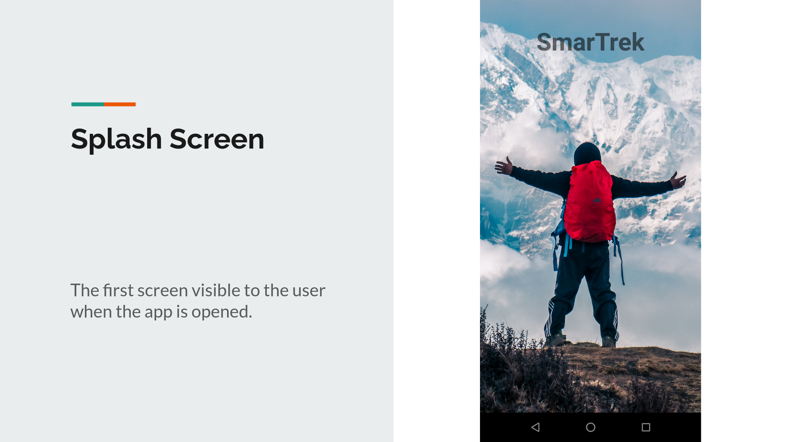
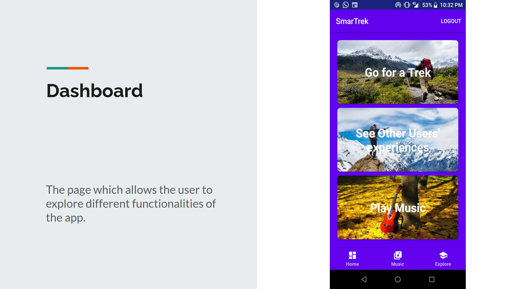
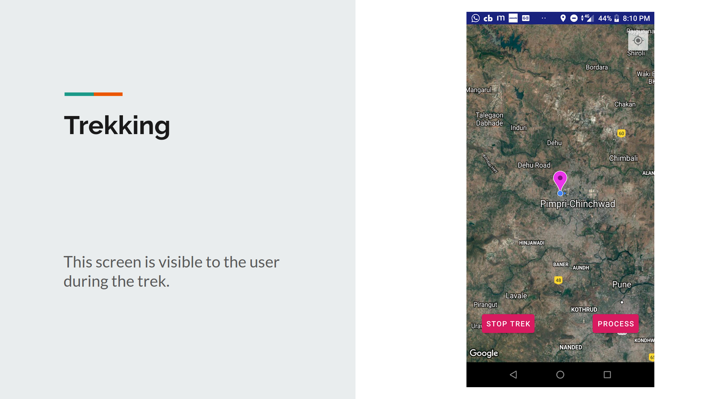
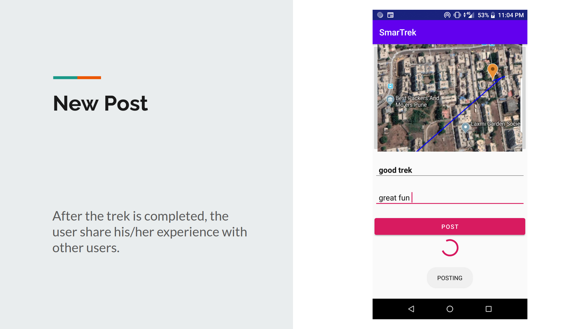
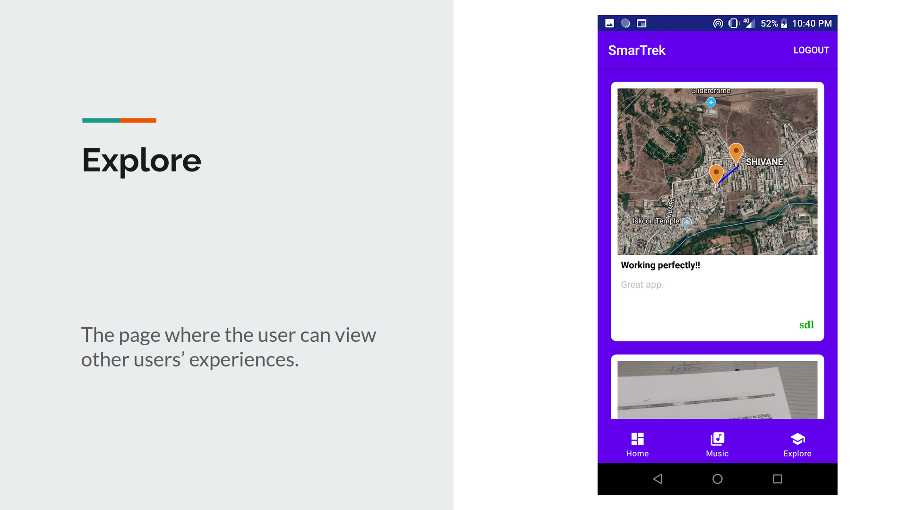
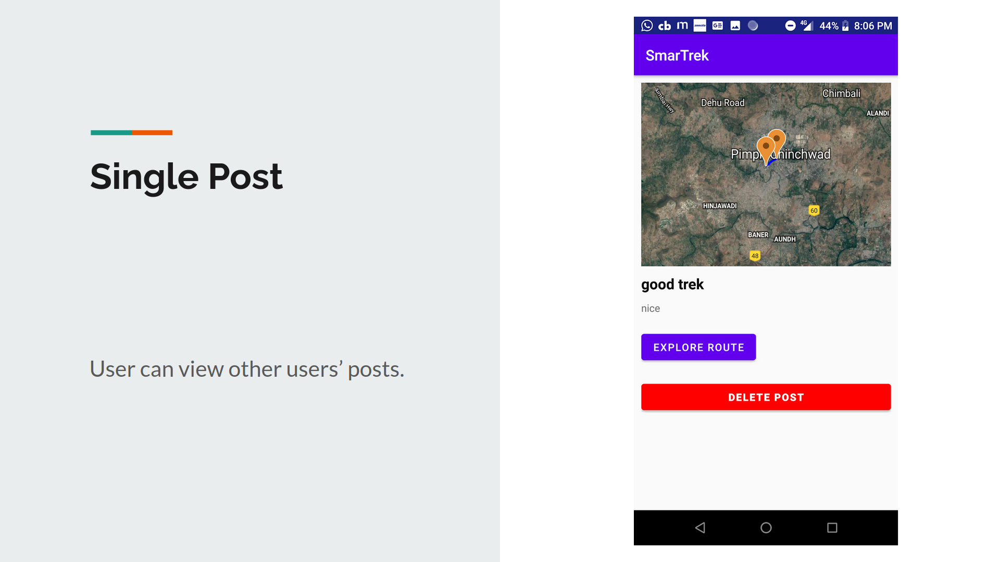
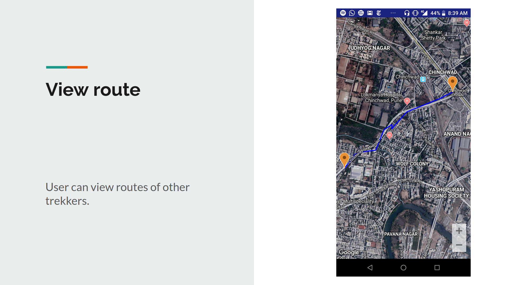
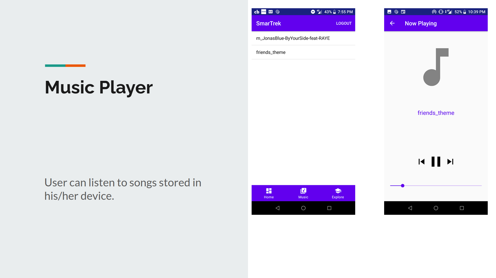

# SmartTrek
Android app to track trekkers location and to post trekking experiences.

## Functionalities added
1. Real time route tracing to analyse path of trek.
2. Route analysis and experrience sharing with integrated blog posts.
3. Location tracing and music support in background.

# Setup
1. Create project with name 'BFit' on firebase.
2. From android studio, connect to firebase.
3. Generate google maps api key and add in manifest file.

# Outputs

